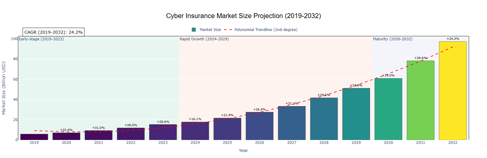

# Cyber-Insurance
Cyber Insurance Market Size Projection (2019-2032)

# Cyber Insurance Market Size Projection (2019–2032)



## Overview
This project visualizes the projected global **cyber insurance market growth** from **2019 to 2032**.  
The analysis combines and visualizes data from two authoritative market research sources:

- **Fortune Business Insights (2023)**  
- **Market Research Future (MRFR, 2024)**  

The projection aligns market size estimates with trends in **cyber incident frequency**, **regulatory expansion**, and **insurance adoption rates**.  
It demonstrates the market’s steady growth from **USD 5.8 billion in 2019** to an expected **USD 97.3 billion by 2032**, with a calculated **Compound Annual Growth Rate (CAGR)** of approximately **24.2%**.

---

## What the Project Does
- Aggregates and harmonizes data from two global research sources.  
- Calculates **year-over-year (YoY)** growth and overall **CAGR**.  
- Visualizes market development across three phases:
  1. **Early-stage (2019–2023)**
  2. **Rapid Growth (2024–2029)**
  3. **Maturity (2030–2032)**
- Applies a **second-degree polynomial trendline** to highlight the growth trajectory.
- Produces an interactive bar chart using **Python (Plotly)** for professional visual presentation.

---

## How the Projection Was Created
1. **Data Collection:**  
   Market size data for 2019–2032 were collected from *Fortune Business Insights* and *Market Research Future* reports.  
   The projections are informed by observed correlations between **cyber incident rates**, **market regulation**, and **insurance adoption** trends.

2. **Data Processing and Visualization:**  
   The dataset was processed in **Python** using `pandas`, `numpy`, and `plotly`.  
   - Year-over-year growth was computed using percentage change.  
   - CAGR was calculated from start and end values (2019–2032).  
   - A polynomial trendline was added to illustrate overall growth.  
   - Market stages were visually segmented with transparent color overlays.

---

## Python Code
```python
import pandas as pd
import numpy as np
import plotly.graph_objects as go
import plotly.express as px

# Data Preparation
years = list(range(2019, 2033))
market_growth = [5.8, 7.1, 9.3, 11.9, 15.3, 17.77, 21.67, 27.5, 33.3, 41.7, 51.19, 60.9, 78.3, 97.3]
df = pd.DataFrame({'Year': years, 'Market Size (Billion)': market_growth})

# Calculate Year-over-Year Growth %
df['YoY Growth %'] = df['Market Size (Billion)'].pct_change() * 100
df['YoY Growth %'] = df['YoY Growth %'].round(1)

# CAGR Calculation
start_value = df['Market Size (Billion)'].iloc[0]
end_value = df['Market Size (Billion)'].iloc[-1]
num_years = len(df) - 1
CAGR = ((end_value / start_value) ** (1 / num_years) - 1) * 100

# Color Bands for Milestones
milestone_colors = []
for year in df['Year']:
    if year <= 2023:
        milestone_colors.append('rgba(102, 194, 165, 0.7)')  # Early-stage
    elif year <= 2029:
        milestone_colors.append('rgba(252, 141, 98, 0.7)')   # Rapid Growth
    else:
        milestone_colors.append('rgba(141, 160, 203, 0.7)')  # Maturity

# Create Bar Chart with Gradient + Shadows
fig = go.Figure()

# Bars with color coding
fig.add_trace(go.Bar(
    x=df['Year'], y=df['Market Size (Billion)'],
    marker=dict(
        color=df['Market Size (Billion)'],
        colorscale='Viridis',
        line=dict(color='black', width=0.5),
    ),
    hovertemplate=
        '<b>Year:</b> %{x}<br>' +
        '<b>Market Size:</b> %{y}B<br>' +
        '<b>YoY Growth:</b> %{customdata[0]}%<br>' +
        '<b>Source:</b> Cyber Insurance Market Report',
    customdata=df[['YoY Growth %']],
    name='Market Size'
))

# Add Milestone Color Bands (Transparent overlays)
fig.add_vrect(x0=2018.5, x1=2023.5, fillcolor="rgba(102, 194, 165, 0.15)", layer="below", line_width=0, annotation_text="Early-stage (2019-2023)", annotation_position="top left")
fig.add_vrect(x0=2023.5, x1=2029.5, fillcolor="rgba(252, 141, 98, 0.1)", layer="below", line_width=0, annotation_text="Rapid Growth (2024-2029)", annotation_position="top left")
fig.add_vrect(x0=2029.5, x1=2032.5, fillcolor="rgba(141, 160, 203, 0.1)", layer="below", line_width=0, annotation_text="Maturity (2030-2032)", annotation_position="top left")

# Trendline (Polynomial 2nd-degree fit)
coeffs = np.polyfit(df['Year'], df['Market Size (Billion)'], 2)
poly_fit = np.poly1d(coeffs)
df['Trendline'] = poly_fit(df['Year'])

fig.add_trace(go.Scatter(
    x=df['Year'], y=df['Trendline'],
    mode='lines',
    line=dict(color='red', dash='dash', width=2),
    name='Polynomial Trendline (2nd-degree)',
    hoverinfo='skip'
))

# Add YoY Growth % labels above bars
for i, row in df.iterrows():
    if i == 0 or pd.isna(row['YoY Growth %']):
        continue
    fig.add_annotation(
        x=row['Year'], y=row['Market Size (Billion)'] + 3,
        text=f"+{row['YoY Growth %']}%",
        showarrow=False,
        font=dict(size=10, color="black")
    )

# CAGR Annotation
fig.add_annotation(
    x=0.01, y=1.08, xref='paper', yref='paper',
    text=f"CAGR (2019-2032): {CAGR:.1f}%",
    showarrow=False,
    font=dict(size=14, color='black'),
    bgcolor="rgba(255,255,255,0.7)",
    bordercolor="black",
    borderwidth=1,
    borderpad=5
)

# Layout Tweaks (Professional Look)
fig.update_layout(
    title={
        'text': 'Cyber Insurance Market Size Projection (2019-2032)',
        'x':0.5, 'xanchor': 'center',
        'font': dict(size=22, family='Arial', color='black')
    },
    xaxis=dict(title='Year', tickmode='linear', dtick=1),
    yaxis=dict(title='Market Size (Billion USD)'),
    plot_bgcolor='white',
    paper_bgcolor='white',
    bargap=0.15,
    margin=dict(l=60, r=60, t=120, b=60),
    legend=dict(orientation="h", yanchor="bottom", y=1.02, xanchor="center", x=0.5),
)

# Light Border Around the Plot (via Paper Color Rect)
fig.add_shape(
    type="rect",
    xref="paper", yref="paper",
    x0=0, y0=0, x1=1, y1=1,
    line=dict(color="black", width=1),
    layer="below"
)

# Show the interactive plot
fig.show()
